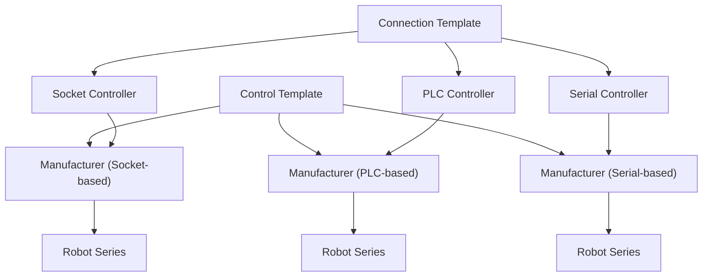

<div align="center">
    <h1></h1>
</div>

A unified Python interface for controlling a variety of industrial and hobbyist robots from different manufacturers.

## Supported Manufacturers & Series

### [Elephant Robotics](https://www.elephantrobotics.com/en/)

- **Models:** myCobot Pro600  
  

### [Universal Robotics](https://www.universal-robots.com)

- **Models:** UR5, UR5e

### [Vention](https://vention.io)

- **Models:** 7th Axis Plate  
  

## Quick Start

### Installation

```text
pip install git+https://github.com/MGross21/armctl.git
```

#### Adding to Project Dependencies

*`requirements.txt`*

```text
git+https://github.com/MGross21/armctl.git
```

*`pyproject.toml`*

```toml
armctl = {git = "https://github.com/MGross21/armctl.git"}
```

### Importing the Library

> [!NOTE]  
> For improved runtime performance and clarity, you may import specific manufacturers and robot series directly.

```python
from armctl import *
```

### Simple Example with Manufacturer Defaults

```python
with Manufacturer("ROBOT_IP_ADDRESS") as robot:
    robot.move_joints([...])
    robot.get_joint_positions()
    robot.move_cartesian([...])
    robot.get_cartesian_position(...)
    robot.sleep(...)
    robot.get_robot_state()
```

### Simple Example with Specific Robot Series

```python
with RobotSeries("ROBOT_IP_ADDRESS") as robot:
    robot.home()
    robot.move_joints([...])
    robot.get_joint_positions()
    robot.move_cartesian([...])
    robot.get_cartesian_position()
    robot.sleep(...)
    robot.get_robot_state()
```

### Multi-Robot Control

```python
with (
  Robot1("ROBOT1_IP_ADDRESS") as r1,
  Robot2("ROBOT2_IP_ADDRESS") as r2,
):
    r1.home()
    r2.home()

    r1.move_joints([...])
    r2.move_joints([...])
```

> [!TIP]  
> For more precise and synchronous control of two or more robots, it is recommended to manage each robot within its own thread or process.

#### Multithread Control

Replicating the prior example,

```python
import threading

def control_robot(robot, ip):
  with robot(ip) as r:
    r.home()
    r.move_joints([0] * r.DOF)

threads = [
  threading.Thread(target=control_robot, args=(Robot1, "ROBOT1_IP")),
  threading.Thread(target=control_robot, args=(Robot2, "ROBOT2_IP"))
]

for t in threads:
  t.start()
for t in threads:
  t.join()
```

## API Reference

> [!NOTE]  
> The API has been designed for maximum compatibility across supported robots. Additional commands, such as gripper controls and other advanced features, are probotfuipses to furrobot ipity.
rControrplate

The fring methods are avareDOFtorted robots.

| Method Name                  | Description                                                                 |
|------------------------------|-----------------------------------------------------------------------------|
| `move_joints(joint_positions, *args, **kwargs)` | Move the robot to specified joint positions.             |
| `get_joint_positions(*args, **kwargs)` | Retrieve the current joint positions of the robot.                |
| `move_cartesian(robot_pose, *args, **kwargs)` | Move the robot to a specified Cartesian pose.              |
| `get_cartesian_position(*args, **kwargs)` | Retrieve the current Cartesian position of the robot.          |
| `stop_motion()`              | Stop all robot motion immediately.                                          |
| `get_robot_state()`          | Retrieve the current state of the robot.                                    |
| `sleep(seconds)`             | Pause execution for a specified number of seconds.                          |
| `home()` <br> <sub>*(Available only for specific robot series, not for generic manufacturer control)*</sub> | Move the robot to its home position. |

### Connection Template

The following methods facilitate explicit connection management and low-level command execution. These are primarily intended for advanced scenarios, such as when not using Python's `with/as` context manager or when sending custom commands outside the standard API. *Use with caution*.

| Method Name                  | Description                                                      |
|------------------------------|------------------------------------------------------------------|
| `connect()`                  | Establish a connection to the robot controller.                  |
| `disconnect()`               | Close the connection to the robot controller.                    |
| `send_command(command, *args, **kwargs)` | Send a low-level command to the robot controller.    |

### Graphical Overview

Below is a high-level diagram illustrating the architecture of the `armctl` library. This design emphasizes the careful templatization of connection and control APIs, ensuring a consistent and extensible interface across different manufacturers and robot series.



## Future Development

- [Dobot](https://www.dobot-robots.com)
  - **Models:** Magician Lite
- [FANUC](https://www.fanucamerica.com)
  - **Models:** LR Mate 200iD Series
- [JAKA](https://www.jaka.com/en)
  - **Models:** Zu 5

## Contributing

Please feel free to submit a pull request or open an issue for any enhancements or bug fixes.

## License

This project is licensed under the MIT License. See the [LICENSE](https://github.com/MGross21/armctl/blob/main/LICENSE) file for more details.
