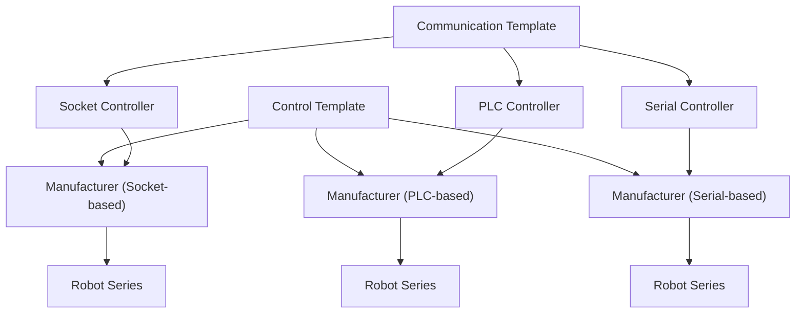

# Template Overview

```mermaid
flowchart TD
    CommTemplate["Communication Template"] --> SocketController["Socket Controller"] & PLCController["PLC Controller"] & SerialController["Serial Controller"]
    CtrlTemplate["Control Template"] --> Manufacturer1["Manufacturer (Socket-based)"] & Manufacturer2["Manufacturer (PLC-based)"] & Manufacturer3["Manufacturer (Serial-based)"]
    SocketController --> Manufacturer1
    PLCController --> Manufacturer2
    SerialController --> Manufacturer3
    Manufacturer2 --> Series2["Robot Series"]
    Manufacturer3 --> Series3["Robot Series"]
    Manufacturer1 --> n3["Robot Series"]
```