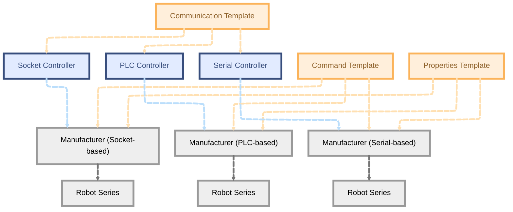

# Template Overview

```mermaid
---
config:
  layout: elk
---
flowchart TB
    CommTemplate["Communication Template"] L_CommTemplate_SocketController_0@--> SocketController["Socket Controller"] & PLCController["PLC Controller"] & SerialController["Serial Controller"]
    CmdTemplate["Command Template"] L_CmdTemplate_Manufacturer1_0@--> Manufacturer1["Manufacturer (Socket-based)"] & Manufacturer2["Manufacturer (PLC-based)"] & Manufacturer3["Manufacturer (Serial-based)"]
    Properties["Properties Template"] L_Properties_Manufacturer1_0@--> Manufacturer1 & Manufacturer3
    Properties L_Properties_Manufacturer2_0@==> Manufacturer2

    SocketController L_SocketController_Manufacturer1_0@--> Manufacturer1
    PLCController L_PLCController_Manufacturer2_0@--> Manufacturer2
    SerialController L_SerialController_Manufacturer3_0@--> Manufacturer3

    Manufacturer1 L_Manufacturer1_Series1_0@--> Series1["Robot Series"]
    Manufacturer2 L_Manufacturer2_Series2_0@--> Series2["Robot Series"]
    Manufacturer3 L_Manufacturer3_Series3_0@--> Series3["Robot Series"]

    %% Class assignments
    CommTemplate:::Class_01
    CommTemplate:::Peach
    SocketController:::Sky
    PLCController:::Sky
    SerialController:::Sky
    CmdTemplate:::Class_01
    CmdTemplate:::Peach
    Manufacturer1:::Ash
    Manufacturer2:::Ash
    Manufacturer3:::Ash
    Properties:::Class_01
    Properties:::Peach
    Series1:::Ash
    Series2:::Ash
    Series3:::Ash

    %% Class definitions with stroke-width 4px
    classDef Class_01 stroke-width:4px,stroke:#FF6D00,fill:#000000
    classDef Sky stroke-width:4px,stroke-dasharray:none,stroke:#374D7C,fill:#E2EBFF,color:#374D7C
    classDef Peach stroke-width:4px,stroke-dasharray:none,stroke:#FBB35A,fill:#FFEFDB,color:#8F632D
    classDef Ash stroke-width:4px,stroke-dasharray:none,stroke:#999999,fill:#EEEEEE,color:#000000

    %% Link styles with stroke-width 4px
    linkStyle 0,1,2,3,4,5,6,7,8 stroke-width:4px,stroke:#FFE0B2,fill:none
    linkStyle 9,10,11 stroke-width:4px,stroke:#BBDEFB,fill:none
    linkStyle 12,13,14 stroke-width:4px,stroke:#757575,fill:none

    %% Animations (non-standard, may require Mermaid extension)
    L_CommTemplate_SocketController_0@{ animation: fast }
    L_CommTemplate_PLCController_0@{ animation: fast }
    L_CommTemplate_SerialController_0@{ animation: fast }
    L_CmdTemplate_Manufacturer1_0@{ animation: fast }
    L_CmdTemplate_Manufacturer2_0@{ animation: fast }
    L_CmdTemplate_Manufacturer3_0@{ animation: fast }
    L_Properties_Manufacturer1_0@{ animation: fast }
    L_Properties_Manufacturer2_0@{ animation: fast }
    L_Properties_Manufacturer3_0@{ animation: fast }
    L_SocketController_Manufacturer1_0@{ animation: fast }
    L_PLCController_Manufacturer2_0@{ animation: fast }
    L_SerialController_Manufacturer3_0@{ animation: fast }
    L_Manufacturer1_Series1_0@{ animation: fast }
    L_Manufacturer2_Series2_0@{ animation: fast }
    L_Manufacturer3_Series3_0@{ animation: fast }
```